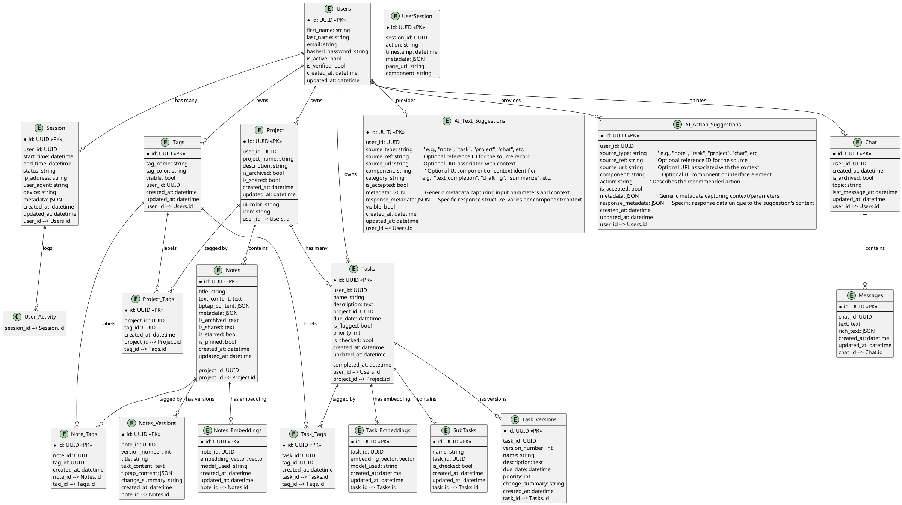

## ERD

```plantuml
@startuml

' --- Entities ---

entity Users {
  *id: UUID <<PK>>
  --
  first_name: string
  last_name: string
  email: string
  hashed_password: string
  is_active: bool
  is_verified: bool
  created_at: datetime
  updated_at: datetime
}

entity Session {
  *id: UUID <<PK>>
  --
  user_id: UUID
  start_time: datetime
  end_time: datetime
  status: string
  ip_address: string
  user_agent: string
  device: string
  metadata: JSON
  created_at: datetime
  updated_at: datetime
}

entity UserSession {
  *id: UUID <<PK>>
  --
  session_id: UUID
  action: string
  timestamp: datetime
  metadata: JSON
  page_url: string
  component: string
}

entity Tags {
  *id: UUID <<PK>>
  --
  tag_name: string
  tag_color: string
  visible: bool
  user_id: UUID
  created_at: datetime
  updated_at: datetime
}

entity Project {
  *id: UUID <<PK>>
  --
  user_id: UUID
  project_name: string
  description: string
  is_archived: bool
  is_shared: bool
  created_at: datetime
  updated_at: datetime
  --
  ui_color: string
  icon: string
}

entity Project_Tags {
  *id: UUID <<PK>>
  --
  project_id: UUID
  tag_id: UUID
  created_at: datetime
}

entity Notes {
  *id: UUID <<PK>>
  --
  title: string
  text_content: text
  tiptap_content: JSON
  metadata: JSON
  is_archived: text
  is_shared: text
  is_starred: bool
  is_pinned: bool
  created_at: datetime
  updated_at: datetime

  project_id: UUID
}

entity Note_Tags {
  *id: UUID <<PK>>
  --
  note_id: UUID
  tag_id: UUID
  created_at: datetime
}

entity Notes_Versions {
  *id: UUID <<PK>>
  --
  note_id: UUID
  version_number: int
  title: string
  text_content: text
  tiptap_content: JSON
  change_summary: string
  created_at: datetime
}


entity Notes_Embeddings {
  *id: UUID <<PK>>
  --
  note_id: UUID
  embedding_vector: vector
  model_used: string
  created_at: datetime
  updated_at: datetime
}


entity Tasks {
  *id: UUID <<PK>>
  --
  user_id: UUID
  name: string
  description: text
  project_id: UUID
  due_date: datetime
  is_flagged: bool
  priority: int
  is_checked: bool
  created_at: datetime
  updated_at: datetime
  --
  completed_at: datetime
}


entity Task_Tags {
  *id: UUID <<PK>>
  --
  task_id: UUID
  tag_id: UUID
  created_at: datetime
}

' --- UNTIL HERE ---

entity Task_Embeddings {
  *id: UUID <<PK>>
  --
  task_id: UUID
  embedding_vector: vector
  model_used: string
  created_at: datetime
  updated_at: datetime
}

entity SubTasks {
  *id: UUID <<PK>>
  --
  name: string
  task_id: UUID
  is_checked: bool
  created_at: datetime
  updated_at: datetime
}

entity Task_Versions {
  *id: UUID <<PK>>
  --
  task_id: UUID
  version_number: int
  name: string
  description: text
  due_date: datetime
  priority: int
  change_summary: string
  created_at: datetime
}

entity AI_Text_Suggestions {
  *id: UUID <<PK>>
  --
  user_id: UUID
  source_type: string        ' e.g., "note", "task", "project", "chat", etc.
  source_ref: string         ' Optional reference ID for the source record
  source_url: string         ' Optional URL associated with context
  component: string          ' Optional UI component or context identifier
  category: string           ' e.g., "text_completion", "drafting", "summarize", etc.
  is_accepted: bool
  metadata: JSON             ' Generic metadata capturing input parameters and context
  response_metadata: JSON    ' Specific response structure, varies per component/context
  visible: bool
  created_at: datetime
  updated_at: datetime
}

entity AI_Action_Suggestions {
  *id: UUID <<PK>>
  --
  user_id: UUID
  source_type: string        ' e.g., "note", "task", "project", "chat", etc.
  source_ref: string         ' Optional reference ID for the source
  source_url: string         ' Optional URL associated with the context
  component: string          ' Optional UI component or interface element
  action: string             ' Describes the recommended action
  is_accepted: bool
  metadata: JSON             ' Generic metadata capturing context/parameters
  response_metadata: JSON    ' Specific response data unique to the suggestion's context
  created_at: datetime
  updated_at: datetime
}

entity Chat {
  *id: UUID <<PK>>
  --
  user_id: UUID
  created_at: datetime
  is_archived: bool
  topic: string
  last_message_at: datetime
  updated_at: datetime
}

entity Messages {
  *id: UUID <<PK>>
  --
  chat_id: UUID
  text: text
  rich_text: JSON
  created_at: datetime
  updated_at: datetime
}

' --- Relationships ---

' Users relationships:
Users ||--o{ Session : "has many"
Users ||--o{ Tags : "owns"
Users ||--o{ Project : "owns"
Users ||--o{ Chat : "initiates"
Users ||--o{ Tasks : "owns"
Users ||--o{ AI_Text_Suggestions : "provides"
Users ||--o{ AI_Action_Suggestions : "provides"

' Session relationships:
Session ||--o{ User_Activity : "logs"

' Tags relationships (via join tables):
Tags ||--o{ Project_Tags : "labels"
Tags ||--o{ Note_Tags : "labels"
Tags ||--o{ Task_Tags : "labels"

' Project relationships:
Project ||--o{ Notes : "contains"
Project ||--o{ Tasks : "has many"
Project ||--o{ Project_Tags : "tagged by"

' Notes relationships:
Notes ||--o{ Notes_Versions : "has versions"
Notes ||--o{ Notes_Embeddings : "has embedding"
Notes ||--o{ Note_Tags : "tagged by"

' Tasks relationships:
Tasks ||--o{ SubTasks : "contains"
Tasks ||--o{ Task_Versions : "has versions"
Tasks ||--o{ Task_Tags : "tagged by"
Tasks ||--o{ Task_Embeddings : "has embedding"

' Chat relationships:
Chat ||--o{ Messages : "contains"

' --- Foreign Key Dependencies (as comments for clarity) ---
Session : user_id --> Users.id
User_Activity : session_id --> Session.id
Tags : user_id --> Users.id
Project : user_id --> Users.id
Project_Tags : project_id --> Project.id
Project_Tags : tag_id --> Tags.id
Notes : project_id --> Project.id
Note_Tags : note_id --> Notes.id
Note_Tags : tag_id --> Tags.id
Notes_Versions : note_id --> Notes.id
Notes_Embeddings : note_id --> Notes.id
Tasks : user_id --> Users.id
Tasks : project_id --> Project.id
Task_Tags : task_id --> Tasks.id
Task_Tags : tag_id --> Tags.id
Task_Embeddings : task_id --> Tasks.id
SubTasks : task_id --> Tasks.id
Task_Versions : task_id --> Tasks.id
AI_Text_Suggestions : user_id --> Users.id
AI_Action_Suggestions : user_id --> Users.id
Chat : user_id --> Users.id
Messages : chat_id --> Chat.id

@enduml

```
